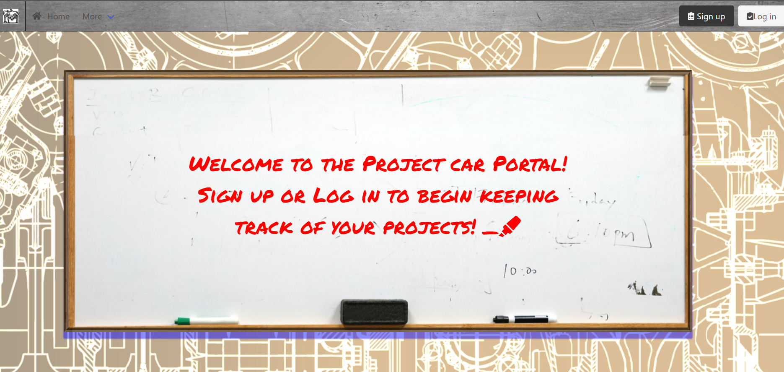

# Project Car Portal

## Description

This is project car portal. The intention of this app is for users who want to keep track of their overall project development when it comes to project cars specifically. The app can be tailored to fit a multitude of hobbies not just transportation based. In the app users will be able to create a new project providing key information they would like to keep track of. They will be able to then add a vehicle they create to their project so they can keep track of things like the overall budget, how much time has been spent working on the project, when the project was started, and tasks that need to be finished in order for the project to be complete. By keeping track of all of this information pertaining to the current projects, users will be able to better manage their time and finances regarding their hobbies so they spend less time working and more time enjoying their passion.

## Installation

- Clone or Download the repository locally
- Fill in your information for the dotenv file
- In the root level of the app run `npm i` to install required packages 
- Next run `npm run seed` to add seed data for testing purposes, not required
- Run `npm run develop` to run both servers locally

## Access to Deployed Application

[Deployed Link](https://project-car-portal.herokuapp.com/)

## Usage

Click on deployed link above. Navigate to the `Sign up` button to create an account or `Login` button if you already possess an account. After logging in, use the nav bar to locate the `Create Project` link. There you will be brought to a form to input the information on your project and save it to the server for future management.

## Screen Shot

## License

[MIT License](LICENSE)

## Future Development

**Currently this app is still in development and more features will be added regularly**

### Features to be added in the future:

- Upload images of your project and receipts of transactions
- Keep track of budget via inputting your project expenses
- Have a to-do list so you can keep track of the tasks you have to get your project running
- Have the ability to add notes to a project so you can jot down quick ideas or make note of important things you find during your project

### End Goal for the APP

In the future I would like to turn this into a social media type app where users can connect with other enthusiasts to help out with eachothers projects. By connecting via social networks users would be able to create a market place amongst their community for services, parts, and group events revolving around their passion.

## How to Contribute

If anyone who shares a passion for DIY projects and would like to help create something to manage that experience, get in touch with me. I would love to expand on this project so I'll be looking forward to hearing from you! 
Reach me at [My Email](d.mosca91@gmail.com) or my [LinkedIn](https://www.linkedin.com/in/devin-mosca/)!